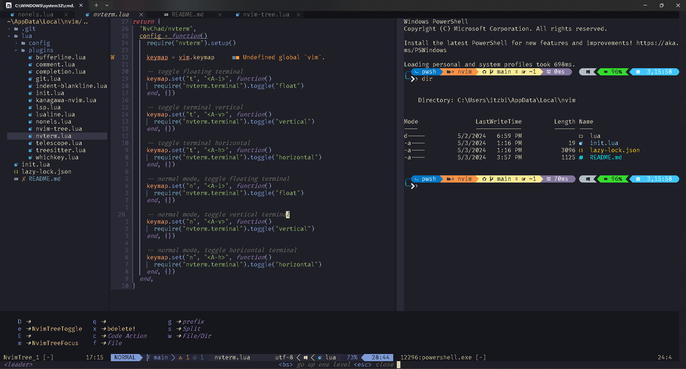

<h1 align="center">Minuettaro Neovim Configuration</h1>

<a href="https://github.com/bintangyosua/minuettaro.nvim">minuettaro.nvim</a> is a customized Neovim configuration created by Bintang Yosua. This Neovim setup is designed to provide a streamlined and efficient development environment for coding enthusiasts.

<!--  -->
    

## Key Features

1. **Minimalistic Design:** The configuration follows a minimalist design approach, focusing on essential plugins and settings to enhance productivity without unnecessary clutter.
2. **Plugin Management:** Minuettaro utilizes a plugin management system **[lazy.nvim](https://github.com/folke/lazy.nvim)** to seamlessly integrate useful plugins for code editing, syntax highlighting, and more. 
3. **Custom Keybindings:** The configuration includes custom keybindings to streamline common tasks and improve workflow efficiency. These keybindings are thoughtfully designed to enhance navigation, editing, and code manipulation within Neovim.
4. **Syntax Highlighting and Linting:** Minuettaro incorporates syntax highlighting and linting features to help developers identify errors and maintain code quality while writing code in Neovim.
5. **Efficient Workflow:** With a focus on speed and performance, Minuettaro ensures a smooth and responsive editing experience, allowing developers to focus on writing code without distractions.
6. **Git Integration:** Minuettaro provides seamless Git integration within Neovim. This allows developers to perform Git operations such as commit, push, pull, branch management, and diff viewing directly from the Neovim interface, enhancing version control workflow efficiency.
7. **Popup Terminal and Easy Navigation:** minuettaro.nvim features a popup terminal that allows developers to open and interact with a terminal window without leaving the Neovim environment. This enables quick access to command line tools and enhances productivity.

## Requirements

1. **Neovim** 0.9.5 or later
2. **LLVM** or **Zig** programming language for treesitter parser
3. **Tar**, **Curl**, and **Git**

## Usage

To use **[minuettaro.nvim](https://github.com/bintangyosua/minuettaro.nvim)**, clone the repository and follow the setup instructions provided in the README.md file. Customize the configuration to suit your preferences and coding style, and enjoy an optimized Neovim environment for your coding projects.

## Plugins Used

- [numToStr/Comment.nvim](https://github.com/numToStr/Comment.nvim) Comments your codes
- [lukas-reineke/indent-blankline.nvim](https://github.com/lukas-reineke/indent-blankline.nvim) Indentation guides to Neovim
- [folke/neoconf.nvim](https://github.com/folke/neoconf.nvim) Neovim plugin to manage global and project-local settings
- [folke/neodev.nvim](https://github.com/folke/neodev.nvim) Full signature help
- [rebelot/kanagawa.nvim](https://github.com/rebelot/kanagawa.nvim) The best color theme so far
- [nvim-tree/nvim-tree.lua](https://github.com/nvim-tree/nvim-tree.lua) A file explorer tree for neovim
- [nvim-telescope/telescope.nvim](https://github.com/nvim-telescope/telescope.nvim) Find, Filter, Preview, Pick. All lua, all the time.
- [folke/which-key.nvim](https://github.com/folke/which-key.nvim) Create key bindings that stick
- [akinsho/bufferline.nvim](https://github.com/akinsho/bufferline.nvim) A snazzy bufferline for Neovim
- [hrsh7th/nvim-cmp](https://github.com/hrsh7th/nvim-cmp) Neovim completion.
- And many moreee.....

## Contributions and Feedback

Contributions to **[minuettaro.nvim](https://github.com/bintangyosua/minuettaro.nvim)** are welcome via pull requests. If you have any feedback, suggestions, or issues, feel free to open an issue on the GitHub repository.
